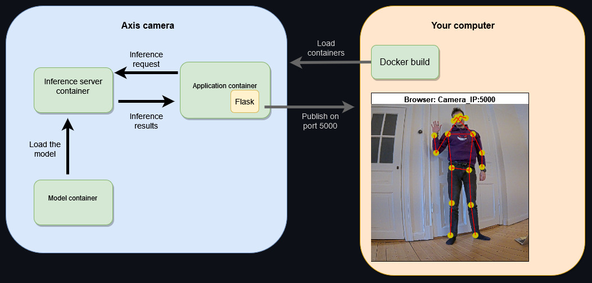
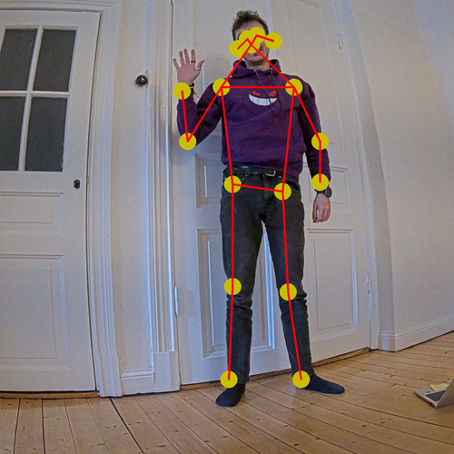

*Copyright (C) 2022, Axis Communications AB, Lund, Sweden. All Rights Reserved.*

# A pose estimator example application on an edge device

This example written in Python implements a pose estimator, that publishes the output using [Flask](https://flask.palletsprojects.com).
The model [MoveNet SinglePose Lightning](https://coral.ai/models/pose-estimation/) takes an 192x192 pixel image as input, and returns the location of 17 keypoints of the human body, with their respective confidence.



## Overview

This example composes three different container images into an application that performs object detection using a deep learning model.

The first container contains the actual program built in this example. It then uses [gRPC](https://grpc.io/)/[protobuf](https://developers.google.com/protocol-buffers) to call the second container, the *inference-server*, that is used to capture images from the camera and perform the actual inference by implementing the [TensorFlow Serving API](https://github.com/tensorflow/serving). You can find more documentation on the [Machine Learning API documentation page](https://developer.axis.com/acap/api/computer-vision-sdk-apis/#machine-learning-api). This example uses a containerized version of the [ACAP Runtime](https://github.com/AxisCommunications/acap-runtime#containerized-version) as the *inference-server*.
Lastly, there is a third container that holds the deep learning model, which is put into a volume that is accessible by the other two images. The layout of the Docker image containing the model is shown below. The *MODEL_PATH* variable in the configuration file you're using specifies what model to use.

```text
model
└── movenet_single_pose_lightning_ptq.tflite - model for CPU and DLPU

```

### Applications

Pose estimation is useful to accomplish several tasks. For example in action detection it can be applied in:

* autonomous driving, to detect if a pedestrian is waiting or crossing a street
* healthcare, to detect if a person is standing or falling.
Pose estimation models are also considered better than object detection at tracking humans. That is because they can keep tracking the human under partial occlusion, where a classic object detection model is more prone to fail.

## Example structure

These are the files used in the example, followed by a brief description of each file:

```text
pose-estimator-with-flask
├── app
│   ├── templates
│   │   └──  index.html
│   └── detector_with_flask.py
├── config
│   ├── env.aarch64.cpu
│   └── env.aarch64.artpec8
├── docker-compose.yml
├── Dockerfile
├── Dockerfile.model
└── README.md
```

* **app/templates/index.html** - Simple HTML page used to render the video stream
* **app/pose-estimator-with-flask.py** - The inference client main program
* **config/** - Configuration file for Docker Compose
* **docker-compose.yml** - Docker Compose file for streaming camera video example using larod inference server
* **Dockerfile** - Docker image with inference client for camera
* **Dockerfile.model** - Docker image with inference model

## Requirements

Meet the following requirements to ensure compatibility with the example:

* Axis device
  * Chip: ARTPEC-8 DLPU devices (e.g., Q1656)
  * Firmware: 11.10 or higher
  * [Docker ACAP](https://github.com/AxisCommunications/docker-acap#installing) version 3.0 installed and started, using TLS with TCP and IPC socket and SD card as storage
* Computer
  * Either [Docker Desktop](https://docs.docker.com/desktop/) version 4.11.1 or higher,
  * or [Docker Engine](https://docs.docker.com/engine/) version 20.10.17 or higher with BuildKit enabled using Docker Compose version 1.29.2 or higher

## How to run the code

### Build the Docker images

Define and export the application image name in `APP_NAME` and the model image name in `MODEL_NAME` for use in the Docker Compose file.
Define and export also the `CHIP` parameter to be used during the build to select the right manifest file.

```sh
export APP_NAME=acap4-pose-estimator-python
export MODEL_NAME=acap-dl-models
export CHIP=artpec8 # Valid options are 'artpec8' (hardware accelerator) or 'cpu'

# Install qemu to allow build for a different architecture
docker run --rm --privileged multiarch/qemu-user-static --credential yes --persistent yes

# Build application image
docker build --tag $APP_NAME .

# Build inference model image
docker build --file Dockerfile.model --tag $MODEL_NAME .
```

### Set your device IP address and clear Docker memory

```sh
DEVICE_IP=<actual camera IP address>
DOCKER_PORT=2376

docker --tlsverify --host tcp://$DEVICE_IP:$DOCKER_PORT system prune --all --force
```

If you encounter any TLS related issues, please see the TLS setup chapter regarding the `DOCKER_CERT_PATH` environment variable in the [Docker ACAP repository](https://github.com/AxisCommunications/docker-acap#securing-the-docker-acap-using-tls).

### Install the images

Browse to the application page of the Axis device:

```sh
http://<AXIS_DEVICE_IP>/index.html#apps
```

Click on the tab `Apps` in the device GUI and enable `Allow unsigned apps` toggle.

Next, the built images needs to be uploaded to the device. This can be done through a registry or directly. In this case, the direct transfer is used by piping the compressed application directly to the device's Docker client:

```sh
docker save $APP_NAME | docker --tlsverify --host tcp://$DEVICE_IP:$DOCKER_PORT load

docker save $MODEL_NAME | docker --tlsverify --host tcp://$DEVICE_IP:$DOCKER_PORT load
```

> [!NOTE]
> If the *inference-server* ([containerized ACAP Runtime](https://github.com/AxisCommunications/acap-runtime#containerized-version)) is not already present on the device, it will be pulled from Docker Hub
> when running `docker compose up`.
> If the pull action fails due to network connectivity, pull the image to your host system and load it to
> the device instead.

### Run the containers

With the application image on the device, it can be started using `docker-compose.yml`:

```sh
docker --tlsverify --host tcp://$DEVICE_IP:$DOCKER_PORT compose --env-file ./config/env.aarch64.$CHIP up

# Terminate with Ctrl-C and cleanup
docker --tlsverify --host tcp://$DEVICE_IP:$DOCKER_PORT compose --env-file ./config/env.aarch64.$CHIP down --volumes
```

### The expected output

In your browser, go to http://$DEVICE_IP:5000 to start the interference. If a person is detected, the key points are drawn on the video stream.



The terminal output shows the key points array and their confidences.

```text
....
pose-estimator_1    | [[0.31955463 0.48752564]
pose-estimator_1    |  [0.2867798  0.5694627 ]
pose-estimator_1    |  [0.2867798  0.5448816 ]
pose-estimator_1    |  [0.31545776 0.5080099 ]
pose-estimator_1    |  [0.3113609  0.4793319 ]
pose-estimator_1    |  [0.35232943 0.46704134]
pose-estimator_1    |  [0.3564263  0.49162248]
pose-estimator_1    |  [0.5162036  0.45065394]
pose-estimator_1    |  [0.36052316 0.4629445 ]
pose-estimator_1    |  [0.5243973  0.5243973 ]
pose-estimator_1    |  [0.53259104 0.53259104]
pose-estimator_1    |  [0.61043125 0.43426654]
pose-estimator_1    |  [0.5448816  0.52030045]
pose-estimator_1    |  [0.70056206 0.43426654]
pose-estimator_1    |  [0.8808236  0.3564263 ]
pose-estimator_1    |  [0.9135984  0.36871687]
pose-estimator_1    |  [0.89311415 0.38510427]]
pose-estimator_1    | [0.02458112 0.02048427 0.02048427 0.05735596 0.02048427 0.05735596
pose-estimator_1    |  0.05735596 0.01638742 0.03687169 0.01229056 0.02048427 0.02458112
pose-estimator_1    |  0.02048427 0.01638742 0.15568045 0.07374337 0.05735596]
```

### Hardware acceleration

The `./config` folder contains configuration files with the parameters to run the inference on different camera models, also giving the possibility to use the hardware accelerator.
To achieve the best performance we recommend using DLPU (Deep Learning Processing Unit) equipped ARTPEC-8 cameras. See [ACAP Computer Vision SDK hardware and compatibility](https://developer.axis.com/acap/axis-devices-and-compatibility/#acap-computer-vision-solution-compatibility)

## License

**[Apache License 2.0](../LICENSE)**
